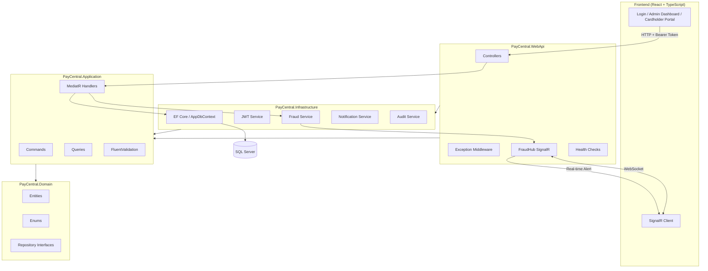
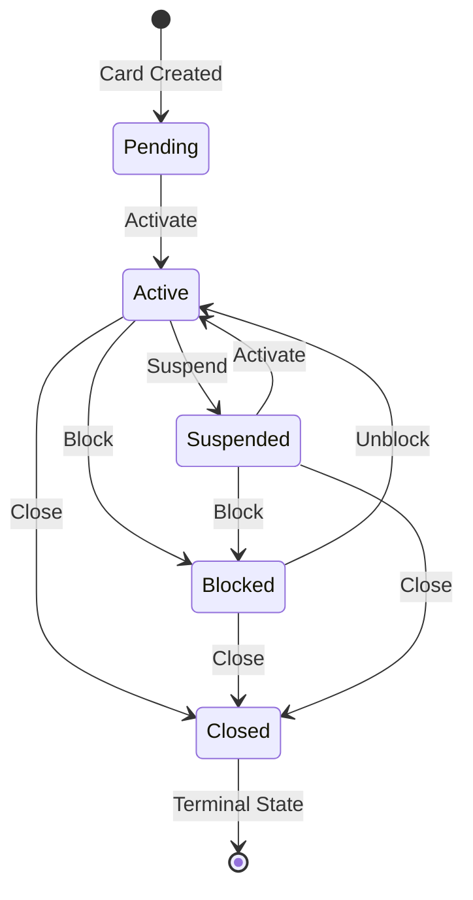
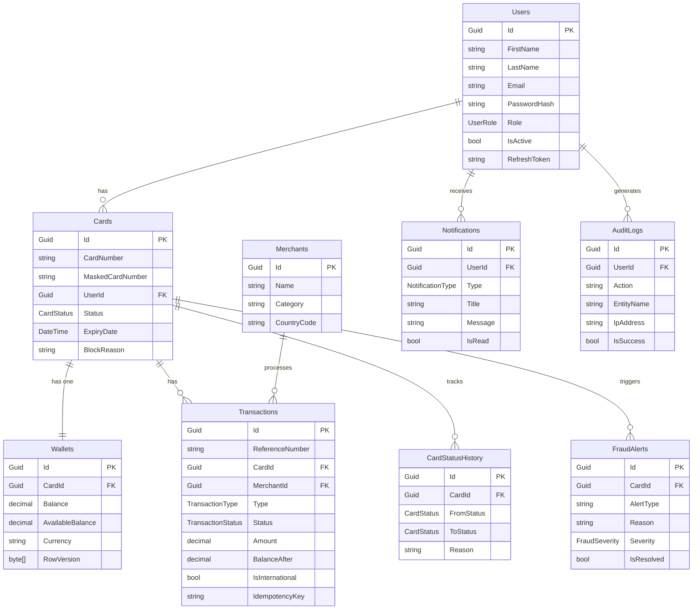
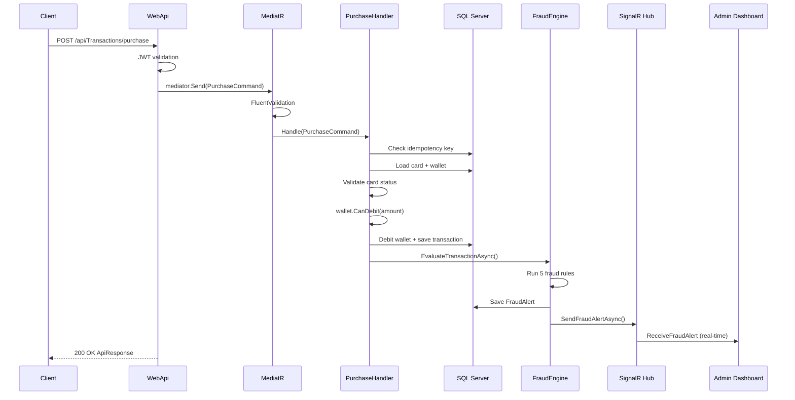

# PayCentral Corporate Expense Card Platform

A production-ready proof of concept for the PayCentral Corporate Expense Card platform built for the Senior Full Stack Developer technical assessment.

---

## Technology Stack

**Backend**
- .NET 8, ASP.NET Core Web API
- Clean Architecture with CQRS and MediatR
- Entity Framework Core 8 with SQL Server
- JWT Authentication with Refresh Tokens
- FluentValidation, Serilog, SignalR
- xUnit, Moq, FluentAssertions

**Frontend**
- React 19 with TypeScript
- Vite, TanStack Query, React Router
- Tailwind CSS, Lucide React
- SignalR Client for real-time alerts

---

## Architecture

Clean Architecture with four layers:
PayCentral.Domain          → Entities, enums, interfaces (no dependencies)
PayCentral.Application     → CQRS handlers, validators, DTOs
PayCentral.Infrastructure  → EF Core, JWT, services, repositories
PayCentral.WebApi          → Controllers, middleware, SignalR hubs

**Key patterns:**
- CQRS with MediatR — every operation is a Command or Query
- Repository pattern via IUnitOfWork
- Pipeline behaviours for cross-cutting concerns
- Domain-driven design — business rules live in domain entities

### Solution Architecture Diagram



---

## Features

**Administrator Portal**
- JWT login with role-based authorization
- Card lifecycle management (Create, Activate, Block, Unblock, Suspend, Close)
- Wallet operations (Load, Debit, Credit, Balance Enquiry)
- Transaction management (Purchase, Reversal, Refund, Fee)
- Real-time fraud alert dashboard via SignalR
- Search across cards, transactions, merchants
- Report generation with CSV and JSON export
- Audit log viewer

**Cardholder Portal**
- View card balance and status
- View recent transaction history
- Receive notifications for card events

**Fraud Detection Engine**

Five independent rules evaluated on every purchase:

| Rule | Threshold | Severity |
|------|-----------|----------|
| Large Spend | R20,000+ within 10 minutes | Critical |
| International Transaction | Merchant country != ZA | Medium |
| Rapid Purchases | 3+ within 60 seconds | High |
| Multiple Merchant Categories | 3+ categories within 1 minute | High |
| Excessive Failed Transactions | 5+ failed transactions | High |

### Card Lifecycle State Machine



---

## Setup Instructions

### Prerequisites
- .NET 8 SDK
- SQL Server (Express or full)
- Node.js 18+

### Backend

1. Clone the repository
```bash
git clone https://github.com/bhargavreddy2019/PayCentral.ExpenseCard.git
cd PayCentral.ExpenseCard
```

2. Update connection string in `PayCentral.WebApi/appsettings.json`:
```json
"DefaultConnection": "Server=YOUR_SERVER;Database=PayCentralExpenseCard;Trusted_Connection=True;TrustServerCertificate=True"
```

3. Run migrations and start:
```bash
cd src/PayCentral.WebApi
dotnet ef database update
dotnet run
```

4. Navigate to `https://localhost:7233/swagger`

### Frontend

```bash
cd paycentral-client
npm install
npm run dev
```

Navigate to `http://localhost:5173`

### Docker

```bash
docker-compose up --build
```

API available at `http://localhost:8080/swagger`

### Test Credentials

| Role | Email | Password |
|------|-------|----------|
| Administrator | admin@paycentral.co.za | Admin@123 |
| Cardholder | john.doe@paycentral.co.za | Cardholder@123 |
| Cardholder | jane.smith@paycentral.co.za | Cardholder@123 |

---

## Database Design

### Entity Relationship Diagram



**Key design decisions:**
- `Wallets.RowVersion` — optimistic concurrency prevents negative balances under load
- `Transactions.IdempotencyKey` — filtered unique index prevents duplicate payments
- Composite index on `Transactions(CardId, CreatedAt DESC)` — most common query pattern
- Composite index on `FraudAlerts(Severity, CreatedAt)` — admin dashboard sorting

---

## API Flow

### Purchase Transaction Flow



---

## API Endpoints

| Method | Endpoint | Description | Role |
|--------|----------|-------------|------|
| POST | /api/Auth/login | Login | Public |
| POST | /api/Auth/refresh | Refresh token | Public |
| GET | /api/Cards | List all cards | Admin |
| POST | /api/Cards | Create card | Admin |
| PUT | /api/Cards/{id}/activate | Activate card | Admin |
| PUT | /api/Cards/{id}/block | Block card | Admin |
| PUT | /api/Cards/{id}/unblock | Unblock card | Admin |
| PUT | /api/Cards/{id}/suspend | Suspend card | Admin |
| PUT | /api/Cards/{id}/close | Close card | Admin |
| GET | /api/Transactions | List transactions | Admin |
| POST | /api/Transactions/load | Load funds | Admin |
| POST | /api/Transactions/purchase | Make purchase | Both |
| POST | /api/Transactions/refund | Process refund | Admin |
| POST | /api/Transactions/reversal | Reverse transaction | Admin |
| GET | /api/Transactions/card/{id}/balance | Get balance | Both |
| GET | /api/Fraud/alerts | Get fraud alerts | Admin |
| PUT | /api/Fraud/alerts/{id}/resolve | Resolve alert | Admin |
| GET | /api/Reports/transactions | Transaction report | Admin |
| GET | /api/Reports/fraud | Fraud report | Admin |
| GET | /api/Reports/cards | Card report | Admin |
| GET | /api/Reports/daily-summary | Daily summary | Admin |
| GET | /api/AuditLogs | View audit logs | Admin |
| GET | /health | Health check | Public |

---

## Security

### Authentication and Authorization
- JWT Bearer tokens with 15-minute expiry
- Refresh token rotation with 7-day expiry
- Role-based policies: AdminOnly, CardholderOnly, AdminOrCardholder
- BCrypt password hashing with work factor 12
- ClockSkew set to zero — no token grace period

### OWASP Top 10

| Risk | Mitigation |
|------|-----------|
| A01 Broken Access Control | RBAC enforced at policy level on every endpoint |
| A02 Cryptographic Failures | BCrypt passwords, HTTPS enforced, JWT HMAC-SHA256 |
| A03 Injection | EF Core parameterized queries, FluentValidation on all inputs |
| A07 Identification Failures | JWT expiry, refresh token rotation, session invalidation |
| A09 Security Logging | Serilog structured logging, full audit trail on all mutations |

### POPIA Compliance
- PII collected: name, email, phone number, transaction history
- Data minimisation — only collect what is operationally required
- Audit log on all data access and mutations with IP address tracking
- Right to erasure — planned for future implementation
- Data breach notification obligation within 72 hours per POPIA Section 22
- No PII logged in application logs — only entity IDs and actions

---

## Testing

18 unit tests covering:
- Fraud rule engine (international, large spend, rapid purchases)
- Wallet balance validation (sufficient funds, zero amount, negative)
- Card status transitions (closed is terminal, pending cannot be blocked)
- Card domain methods (mask card number, generate card number)

```bash
cd tests/PayCentral.Tests
dotnet test
```

---

## AI Usage

See `AI-PROMPT-LOG.md` for full documentation of:
- Every AI prompt used during development
- What AI produced vs what was changed manually
- Engineering decisions made independently
- Where AI failed and what was rewritten

---

## Assumptions

- Card numbers are system-generated in Visa format (starting with 4)
- International transaction = merchant country code is not ZA
- Low balance threshold = R100
- Notification delivery is mocked — no real Email/SMS/Push provider
- Currency is ZAR only — multi-currency is a future improvement
- Card numbers stored as plain text — PCI-DSS tokenisation is future work

---

## Future Improvements

- **Azure Service Bus** — move fraud detection to async queue
- **Redis** — idempotency key storage and balance caching
- **PCI-DSS tokenisation** — replace card numbers with tokens
- **OpenTelemetry** — distributed tracing
- **Right to erasure endpoint** — POPIA compliance
- **Rate limiting** — brute force protection on auth endpoints
- **Azure Key Vault** — secrets management
- **Multi-currency support**
- **End-to-end integration tests**
- **CI/CD pipeline** — GitHub Actions to Azure

---

*Built with Clean Architecture, CQRS, and engineering judgement over feature count.*  
*PayCentral Senior Full Stack Developer Assessment — Bhargav*