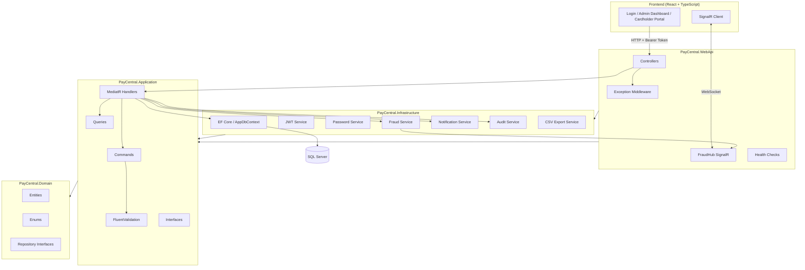
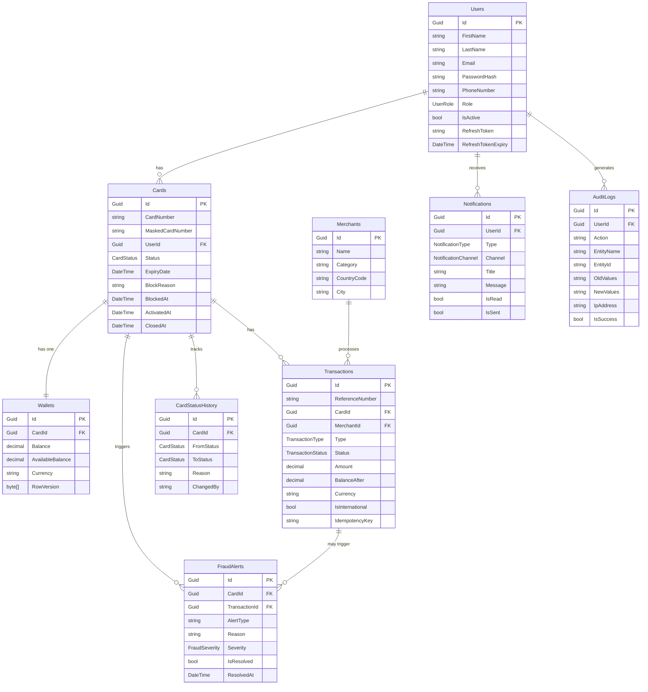
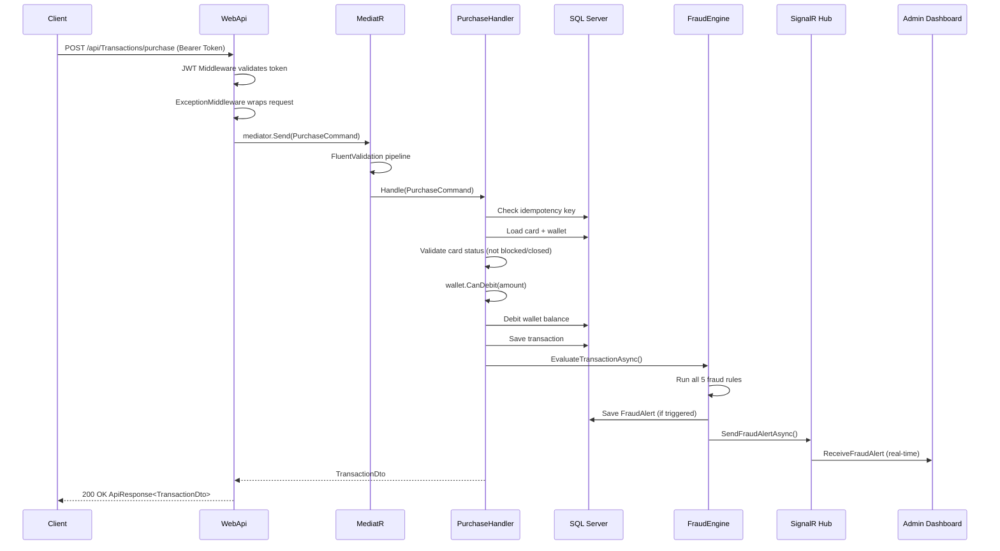
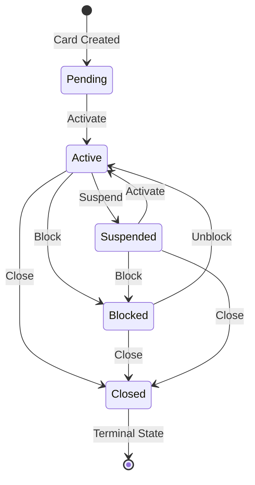

# PayCentral — Architecture Diagrams

## 1. Solution Architecture

---

## 2. Entity Relationship Diagram

---

## 3. API Flow Diagram — Purchase Transaction

---

## 4. Card Lifecycle State Machine

